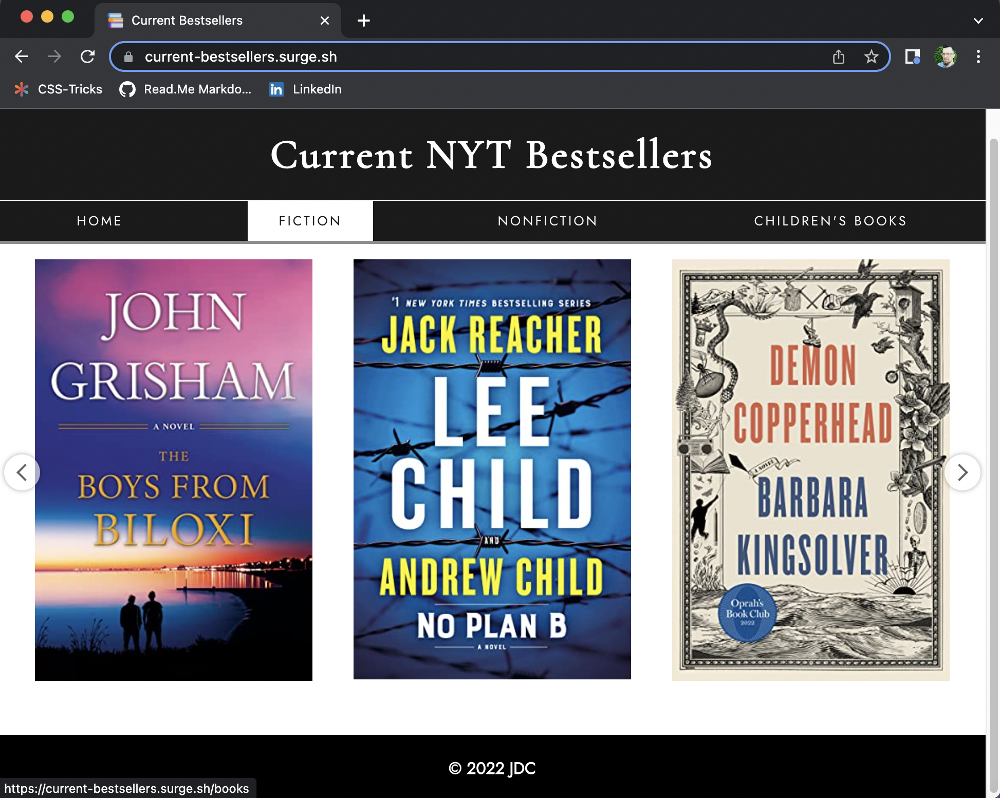

# Current Bestselling Books

## Description
Front-end application built with React.js and third party API (New York Times Bestselling Books Lists). Visit the deployed site at https://current-bestsellers.surge.sh/ 

 

 

### Overview
For those wanting something new to read or curious about what others are reading, this application allows them to discover what books are currently trending. The New York Times Best Seller's Lists pulled in this API call are published weekly, so the data refreshes each week, which ensures users will have the most current data. Users can select specific book lists based on interest to view the top books in that category according to rank. From ranked lists, users can select specific books to learn more about them. Users can determine whether or not a book on the list appeals to them and is worth their investment of time and money.

### Preparation and Planning
#### Trello
Preparation began with thorough review of project requirements. First steps included initial project planning followed by review of various API's. Once the API was selected, the project was planned in detail using a Trello board to establish deadlines and key milestones.

#### Github & Figma
Next steps included decision on MVP for this app, composition of basic user stories, and opening a new Github repository. After that, a component hierarchy was sketched in Figma along with wireframe diagrams of layouts in order to map out the architecture of the application ahead of time.

### Technologies Used
This project was built using the following technologies, libraries & frameworks: 

* React.js
  - useState()
  - useEffect()
  - useNavigate()
  - useParams()
* React-Router-DOM
  - Links and Routes
* Axios Library
* VS Code and Terminal
* Surge
* Favicons
* Google Fonts
  - Jost (sans serif)
  - Cormorant (serif)

## Credits & Acknowledgements
The following resources were invaluable at different points in my project: 
 
* [Flexbox Nav Menu with Animation](https://codepen.io/mycarrera/pen/GpKwxO)

* [Flexbox Footer](https://dev.to/akshay_rajput/keep-footer-at-bottom-of-page-using-flexbox-4a6f)

* [Responsive Carousel](https://reactjsexample.com/react-responsive-carousel-component-with-grid-layout-to-easily-create-a-carousel-like-photo-gallery/)

* [React Router useParams()](https://medium.com/geekculture/how-to-use-react-router-useparams-436851fd5ef6) & the [video](https://www.youtube.com/watch?v=BLbTGKUzND4) linked at the bottom of the article

## Use & Contribution
To make use of this repository you may `fork` and `clone` it. Then, in your terminal make a new directory using the command `mkdir react-app`. Open the new directory and use the command `git clone` followed by the copied `clone` link. 

### Contributions
If you identify bugs or would like to contribute to the code, or want to propose improvements, please contact me. Thanks!

